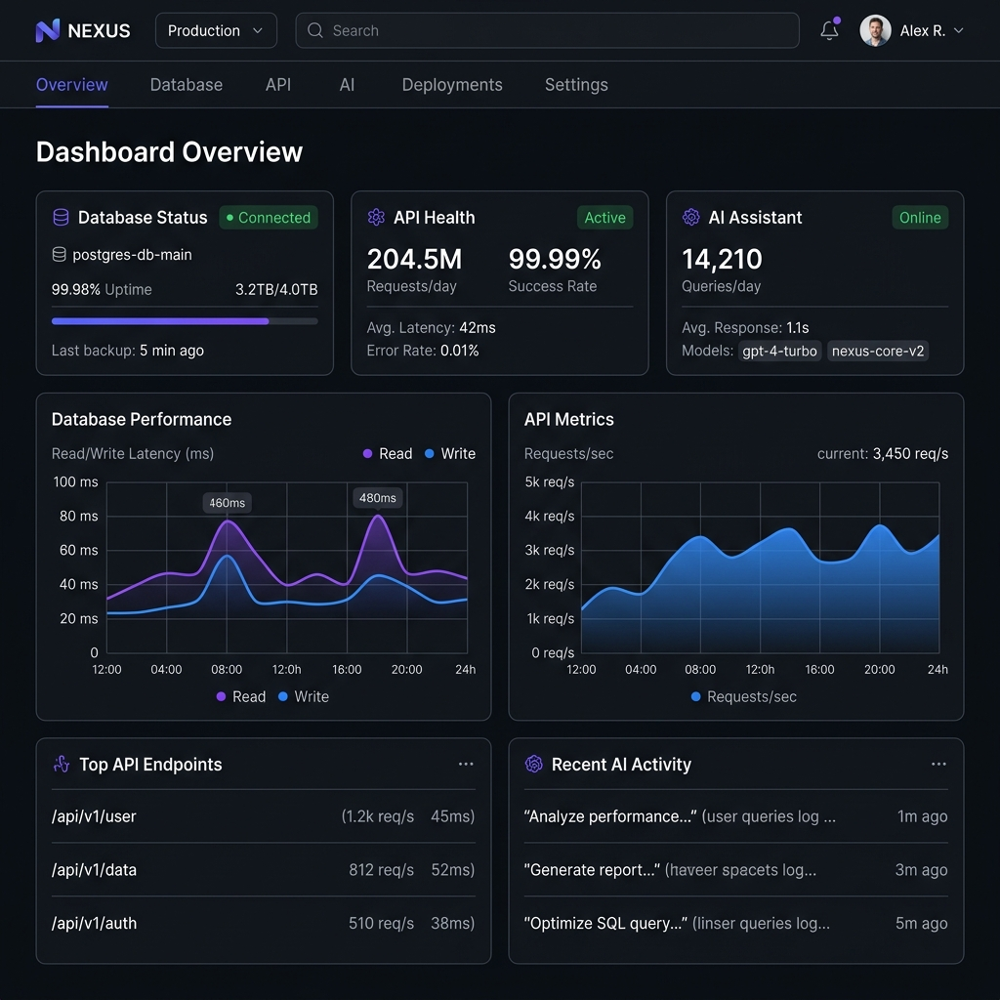
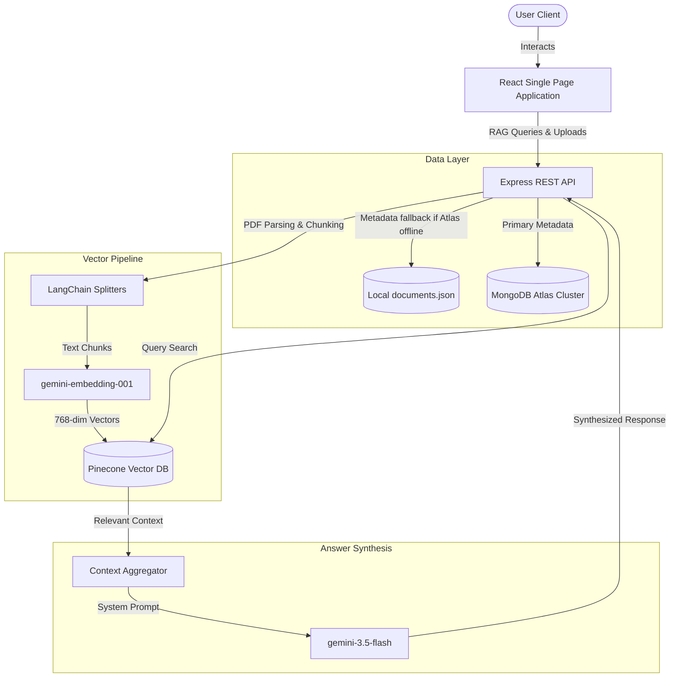

# 🔮 KnowledgeHub AI — Enterprise Knowledge Intelligence Platform

> A premium, high-performance RAG-powered Enterprise Knowledge Intelligence Platform built for modern workspaces. Powered by Google Gemini and Pinecone Vector Database, with a zero-configuration local database fallback.



---

## 🚀 Key Features

*   **⚡ Live RAG (Retrieval-Augmented Generation)**: Upload product manuals, custom user guides, or FAQs to inject real-time context directly into LLM support conversations.
*   **🎙️ Integrated Voice Speech Assistant**: Transcribe audio queries in real-time directly inside the AI console with floating waveform feedback.
*   **🧠 Dual Model Intelligence**:
    *   **Embeddings**: Powered by `gemini-embedding-001` (optimized to `768` dimensions).
    *   **Generation**: Powered by the advanced `gemini-3.5-flash` model, ensuring fast response times and low-latency.
*   **💾 Zero-Configuration Local DB Fallback**: If MongoDB Atlas connection fails or encounters firewall blockages (such as missing IP whitelisting), the server automatically activates a local JSON database fallback (`documents.json`) to keep the system fully functional.
*   **📱 Glassmorphic Responsive Layout**: Beautiful Vercel/Linear-inspired dark/light theme options, responsive top navbar, and an overlay sidebar drawer designed for seamless mobile navigation.
*   **🔄 Automated Index Status Polling**: The frontend automatically polls processing documents from the server and updates RAG indexing statuses in real-time.
*   **📊 Integrated Performance Dashboard**: Visualizes weekly query volumes and logs server event streams dynamically.

---

## 📂 Project Architecture



### Detailed Component Overview

1.  **Ingestion & Parsing**: When a PDF is uploaded, `pdf-parse` extracts raw text, which is sent to LangChain's `RecursiveCharacterTextSplitter`. Text is segmented into chunks of `1000` characters with a `200` character overlap to maintain semantic continuity across boundaries.
2.  **Vector Mapping & Upsert**: Chunks are mapped to 768-dimension vectors using Google's embedding model and batch-uploaded in sizes of `100` to Pinecone DB to prevent payload throttling.
3.  **Context-Retrieval Loop**: When querying the AI, the query is embedded and matched against Pinecone vectors. Matching chunks with a similarity score `> 0.3` are loaded as prompt contexts.
4.  **Generative Synthesis**: The matched context is merged into a system template forcing the LLM to restrict answers to context blocks, eliminating hallucinations.
5.  **Failover Storage**: The database connector manages connectivity checks. If the MongoDB cluster is unreachable, Mongoose triggers a file-based cache at `backend/data/documents.json`.

---

## 🎙️ Integrated Voice Speech Assistant

The AI Chat interface features a native Voice Assistant powered by the browser's Web Speech API:

*   **Technology**: Uses standard `window.SpeechRecognition` (and `window.webkitSpeechRecognition` fallback) to perform client-side voice-to-text translation.
*   **Microphone Handlers**: Handles active recording overlays and animates an interactive floating waveform indicator representing audio input levels.
*   **Flow**:
    1. Clicking the microphone button requests browser audio permissions.
    2. Real-time audio streams are transcribed locally.
    3. The speech result populates the chat input field, allowing instant submissions.
*   **Browser Compatibility**: Native support across Google Chrome, Microsoft Edge, and Apple Safari. Falls back gracefully to simulation buttons if microphone blocks are active.

---

## 🔌 API Documentation

All API endpoints are mounted under the `/api` route path:

### 1. Chat Pipeline
*   **`POST /api/chat`**
    *   *Description*: Evaluates the user query, queries Pinecone database vectors, and returns synthesized answers.
    *   *Body JSON*:
        ```json
        {
          "message": "What is the return policy for our plans?"
        }
        ```
    *   *Response JSON*:
        ```json
        {
          "success": true,
          "text": "The return policy allows cancellations within 14 days...",
          "simulated": false,
          "sources": ["refund_policy_guide.pdf"]
        }
        ```

### 2. Document Catalog
*   **`POST /api/documents/upload`**
    *   *Description*: Uploads a PDF manual, writes metadata to database, and initiates background indexing.
    *   *Content-Type*: `multipart/form-data`
    *   *Payload*: `file: File (PDF, max 10MB)`
    *   *Response JSON*:
        ```json
        {
          "success": true,
          "message": "File uploaded and queued for vector embedding.",
          "document": {
            "_id": "64cbca9f...",
            "originalName": "API_Specs.pdf",
            "size": 409600,
            "status": "uploaded"
          }
        }
        ```

*   **`GET /api/documents`**
    *   *Description*: Retrieves a list of all ingested document records.
    *   *Response JSON*:
        ```json
        [
          {
            "_id": "64cbca9f...",
            "originalName": "API_Specs.pdf",
            "size": 409600,
            "status": "processed",
            "createdAt": "2026-08-01T18:50:00.000Z"
          }
        ]
        ```

*   **`DELETE /api/documents/:id`**
    *   *Description*: Deletes the document metadata record and purges all related vector embeddings inside Pinecone.
    *   *Response JSON*:
        ```json
        {
          "success": true,
          "message": "Document record and related vector embeddings purged successfully."
        }
        ```

### 3. Server Health
*   **`GET /api/health`**
    *   *Description*: Checks cluster status and database connector fallback modes.
    *   *Response JSON*:
        ```json
        {
          "status": "OK",
          "timestamp": "2026-08-02T00:30:00.000Z",
          "uptime": 86400,
          "database": {
            "status": "connected",
            "code": 1
          }
        }
        ```

---

## ⚙️ Quick Installation

### Prerequisites
Make sure you have [Node.js](https://nodejs.org/) (v18 or higher) installed.

### 1. Setup Backend
1. Navigate to the backend directory:
   ```bash
   cd backend
   ```
2. Install dependencies:
   ```bash
   npm install
   ```
3. Create a `.env` file in the `backend/` folder and configure it using the template below:
   ```env
   # Database Configuration (Atlas or Local fallback)
   MONGO_URI=mongodb+srv://<username>:<password>@cluster.mongodb.net/dbname

   # Google Gemini API
   GEMINI_API_KEY=your_gemini_api_key_here

   # Pinecone Vector Database Configuration
   PINE_CONE_API_KEY=your_pinecone_api_key_here
   PINECONE_INDEX_NAME=ai-support-assistant
   ```
4. Start the backend development server:
   ```bash
   npm run dev
   ```

### 2. Setup Frontend
1. Navigate to the frontend directory:
   ```bash
   cd ../frontend
   ```
2. Install dependencies:
   ```bash
   npm install
   ```
3. Start the Vite development server:
   ```bash
   npm run dev
   ```
4. Open the application in your browser at `http://localhost:5173`.

---

## 🛡️ Database Fallback Mechanism
KnowledgeHub AI contains a fallback system in `src/config/db.js` and `src/models/Document.js`. If the `MONGO_URI` connection times out or fails (e.g., due to IP Whitelisting restrictions on remote clusters), the system logs a warning:
> `⚠️ Falling back to local JSON database (documents.json) for storage.`

All metadata creations, retrievals, and deletions automatically redirect to a local database at `backend/data/documents.json`. This keeps the API online and allows you to test vector indexing and RAG pipeline workflows entirely offline.
