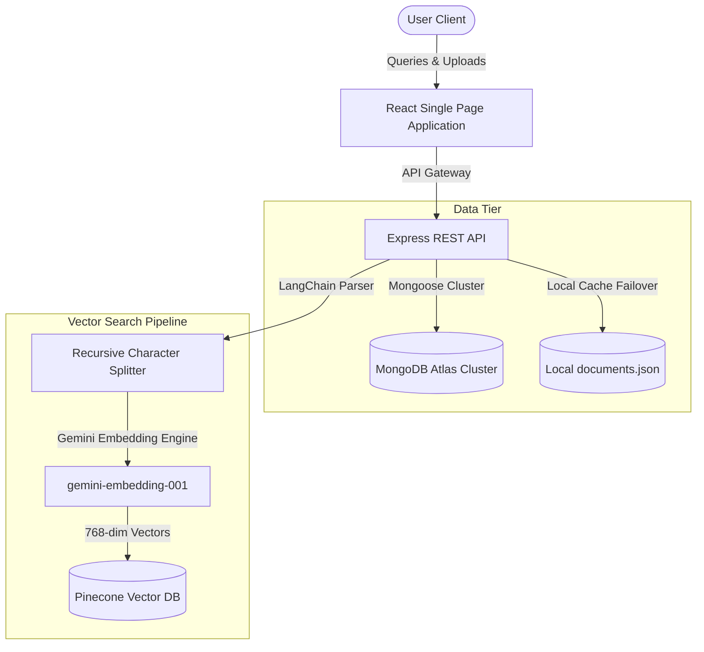

# THEDAL — Enterprise Knowledge Intelligence Platform

> State-of-the-Art Enterprise Knowledge Intelligence and Context-Aware Semantic Search Solution.

---

## 📄 Tagline
Unify, search, and synthesize organizational knowledge securely with low-latency neural retrieval.

---

## 🔮 Product Overview
THEDAL is an enterprise-grade Retrieval-Augmented Generation (RAG) platform designed to index complex unstructured manuals, technical spec sheets, FAQs, and product guides. It compiles them into high-density vector embeds for seamless query resolution. By merging secure database endpoints with Google Gemini language reasoning models, THEDAL eliminates model hallucinations, delivering contextual knowledge to teammates and departments instantly.

The platform is designed to prioritize high accessibility, touch responsiveness, data privacy, and adaptive connection states. It provides an offline failover engine that switches to a local datastore if cloud clusters are inaccessible.

---

## 🚀 Key Capabilities
*   **⚡ Sub-250ms Context Ingestion**: PDF uploads are automatically processed, split, and vectorized via Gemini neural pipelines.
*   **🎙️ Integrated Voice Assistant (Play/Pause, Skip controls)**: Fully local speech-to-text input paired with an Indian English voice synthesizer for hands-free operations.
*   **💻 Responsive Dashboard Telemetry**: Visualizes system queries, latency spikes, and live pipeline status updates.
*   **🛡️ Private Configuration Enclosure**: Replaces vulnerable user-facing credentials forms with secure server env handchecks.
*   **💾 Database Core Failover**: Automatically activates a local JSON database fallback (`documents.json`) if MongoDB Atlas becomes unreachable.
*   **🎨 Elite Industrial Dark Mode**: Custom CSS layout following professional, distraction-free corporate layouts.

---

## 📂 Project Architecture



---

## 🛠️ Technology Stack
*   **Frontend**: React (Vite), Tailwind CSS, Framer Motion, Axios for API interfacing.
*   **Backend**: Node.js, Express web server framework.
*   **Databases**: MongoDB Atlas (metadata), Pinecone (Vector database).
*   **Model Intelligence**: Google Gemini (Embeddings and LLM synthesis).

---

## 🔄 System Workflow
1.  **Ingestion & Parsing**: PDFs are chunked into 1000-character segments with a 200-character overlapping slice.
2.  **Vector Mapping**: Text segments are converted to 768-dimension vectors and stored in Pinecone database namespaces.
3.  **Prompt Synthesis**: Queries search Pinecone database indices. Relevant text chunks with a cosine similarity > 0.3 are structured inside system prompt templates.
4.  **Generative Inference**: Gemini API synthesizes responses restricted strictly to the gathered materials.

---

## 📁 Project Structure
```
thedal-rag/
├── backend/
│   ├── src/
│   │   ├── config/       # Connection parameters & fallbacks
│   │   ├── models/       # Mongoose schemas
│   │   ├── routes/       # Express endpoints
│   │   └── app.js        # Server gateway app
│   ├── data/             # Local offline database files
│   └── package.json
└── frontend/
    ├── src/
    │   ├── components/   # Modular dashboard items
    │   ├── pages/        # Main route screens (Overview, Ask THEDAL, Documents)
    │   └── App.jsx       # Theme and entry router
    └── package.json
```

---

## ⚙️ Installation

To initialize THEDAL locally, install dependencies in both the backend and frontend directories:

```bash
# Clone the repository
git clone https://github.com/your-org/thedal-rag.git
cd thedal-rag
```

---

## 🔑 Environment Variables
Configure primary credentials in `backend/.env`. Ensure you do not expose private keys in client-side code:

```env
# Database Credentials
MONGO_URI=mongodb+srv://<username>:<password>@cluster.mongodb.net/dbname

# Intelligence model key
GEMINI_API_KEY=your_gemini_api_key_here

# Pinecone credentials
PINE_CONE_API_KEY=your_pinecone_api_key_here
PINECONE_INDEX_NAME=ai-support-assistant
```

---

## 💻 Local Development

### 1. Backend Setup
1. Inside `backend`, install dependencies:
   ```bash
   cd backend
   npm install
   ```
2. Configure your credentials inside `.env`.
3. Launch development server:
   ```bash
   npm run dev
   ```

### 2. Frontend Setup
1. Inside `frontend`, install dependencies:
   ```bash
   cd ../frontend
   npm install
   ```
2. Launch Vite local compiler:
   ```bash
   npm run dev
   ```
3. Open the product at `http://localhost:5173`.

---

## 💾 Database Setup
1. Create a MongoDB Atlas cluster or install MongoDB locally.
2. Provide the database connection link in the `MONGO_URI` variable.
3. If no URI is configured, the server defaults to the local storage failover `backend/data/documents.json`.

---

## 🌲 Pinecone Setup
1. Create a Pinecone database dashboard account.
2. Initialize an index with exactly `768` dimensions using the Cosine distance metric.
3. Paste keys into your config environment variables.

---

## 🤖 Gemini Setup
1. Retrieve an API Key from Google AI Studio.
2. Configure parameters within the `GEMINI_API_KEY` placeholder. 

---

## 🔌 API Overview
*   **`POST /api/chat`**: Query vector indices for synthesized context responses.
*   **`POST /api/documents/upload`**: Ingest PDF guidelines metadata.
*   **`GET /api/documents`**: Fetch database logs catalog.
*   **`DELETE /api/documents/:id`**: Purge files and corresponding vector embeddings.
*   **`GET /api/health`**: Retrieve host connection stats, database status, and cluster uptime.

---

## 🚀 Deployment
Deploy THEDAL using standard cloud structures:
*   **Frontend**: Host on Vercel or Netlify. Set `VITE_API_BASE_URL` in project settings.
*   **Backend**: Host on Render, AWS App Runner, or Heroku. Configure environment keys securely.

---

## 🛡️ Security Considerations
*   **Key Enclosures**: Credentials are kept strictly on the host environment; the frontend client never loads raw secrets.
*   **Data Isolation**: All document deletions dynamically purge linked Pinecone vectors using metadata indices.
*   **HTTPS Interlacing**: CORS configurations restrict requests to defined production gateways.

---

## ⚡ Performance Considerations
*   **Vectored Batching**: Pinecone upsert actions run in batches of 100 to prevent payload throttling.
*   **Optimized Bundling**: Assets are compressed with Vite, maintaining sub-second client load timings.

---

## 🗺️ Future Roadmap
1.  **Multi-Language Audio Interfacing**: Support for non-English manuals (French, Spanish, German).
2.  **Role-Based Access Controls (RBAC)**: Fine-grained user access gates.
3.  **Active Directory (AD) / Azure SSO Integration**: Enterprise user registry sync.

---

## 🤝 Contributing
Please submit clean pull requests with detailed tests. For major enhancements, open discussion threads with design systems documentation.

---

## ⚖️ License
Enterprise Proprietary License. Copyright © 2026 THEDAL. All rights reserved.
